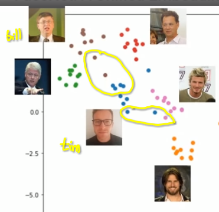
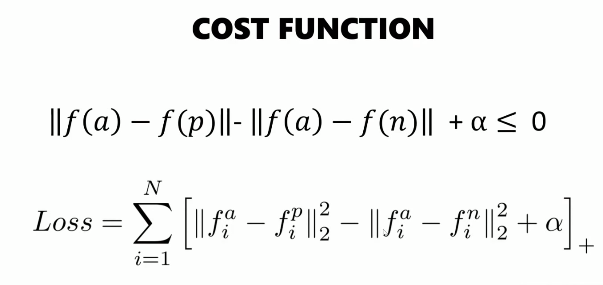

 
 
 

---
# "FaceNet: A Unified Embedding for Face Recognition and Clustering"
---

 
 

The main theme of the FaceNet paper introduced by Google researchers in the paper titled **"FaceNet: A Unified Embedding for Face Recognition and Clustering,"** focuses on the following key ideas:

### **1. Face Embedding:**
   - The primary concept of FaceNet is to convert a face image into a compact, fixed-size vector representation, known as an **embedding**. Specifically, the model reduces the facial image to a 128-dimensional vector. This vector captures the essential features of the face in a way that similar faces (e.g., images of the same person) have embeddings that are close together in this high-dimensional space, while dissimilar faces (e.g., different people) have embeddings that are far apart.

### **2. Efficient Storage and Search:**
   - The 128-dimensional vector (embedding) is small enough to allow efficient storage and search operations, even when dealing with large datasets. This compact representation is what makes FaceNet particularly powerful and practical for real-world applications.

### **3. Face Recognition:**
Face recognition is a technology that identifies or verifies individuals by analyzing their facial features. It involves capturing a face image, extracting unique features, and comparing them to a database of known faces. There are two main tasks within face recognition:

**Face Identification:**
   - The system matches a given face to a list of stored identities to determine "who" the person is. It's a one-to-many comparison where the system identifies the face from a pool of candidates.

**Face Verification:**
   - The system verifies if two face images belong to the same person. It's a one-to-one comparison, commonly used in authentication systems (e.g., unlocking a phone with facial recognition).

### **4. Face Clustering:**
Face clustering is the process of grouping a set of facial images so that images of the same person are placed in the same group (or cluster), without needing prior labels. This is useful when working with large, unlabeled datasets, as it can automatically organize images into clusters representing different individuals.

- **Unsupervised Learning**: Clustering is typically performed using unsupervised learning techniques, where the model finds patterns in the data without any labeled examples.

 
 

---
---
---

 
 

# Abstract of FaceNet:

Despite significant recent advances in the field of face
recognition [10, 14, 15, 17], implementing face verification
and recognition efficiently at scale presents serious challenges to current approaches `(এখানে, ২০১৫ সালের দিকে পেপারটি বের হয়েছে । তখন,face
recognition field এ যা কাজ হয়েছিলো সেইটা দিয়ে কখনো **at scale** Production Level এ একটা বানানো সম্ভব ছিল না ।)`. In this paper we present a
system, called FaceNet, that directly learns a mapping from
face images to a compact Euclidean space where distances
directly correspond to a measure of face similarity. Once
this space has been produced, tasks such as face recognition, verification and clustering can be easily implemented
using standard techniques with FaceNet embeddings as feature vectors.
Our method uses a `deep convolutional network(We explain it later)` trained
to directly optimize the embedding itself, rather than an intermediate bottleneck layer as in previous deep learning
approaches. To train, we use triplets of roughly aligned
matching / non-matching face patches generated using a
novel online triplet mining method. The benefit of our
approach is much greater representational efficiency: we
achieve state-of-the-art face recognition performance using
only 128-bytes per face.
On the widely used Labeled Faces in the Wild (LFW)
dataset, our system achieves a new record accuracy of
99.63%. On YouTube Faces DB it achieves 95.12%. Our
system cuts the error rate in comparison to the best published result [15] by 30% on both datasets.
We also introduce the concept of harmonic embeddings,
and a harmonic triplet loss, which describe different versions of face embeddings (produced by different networks)
that are compatible to each other and allow for direct comparison between each other.

# **Deep Convolutional Neural Network (CNN)**

### **History and Key Contributors:**

- **Yann LeCun**:
  - **LeNet-5** (1998): Developed by Yann LeCun and his colleagues, LeNet-5 was one of the earliest successful implementations of CNNs, used for digit recognition on the MNIST dataset. This work laid the groundwork for many subsequent developments in CNNs.

- **Alex Krizhevsky, Ilya Sutskever, and Geoffrey Hinton**:
  - **AlexNet** (2012): This network achieved breakthrough performance in the ImageNet Large Scale Visual Recognition Challenge (ILSVRC). It demonstrated the power of deep CNNs for image classification and sparked renewed interest in deep learning.

### Summary:
While Yann LeCun's work on LeNet-5 was foundational, AlexNet is often credited with popularizing deep CNNs in the modern era due to its exceptional performance and impact on the field. Both contributions were crucial in the development and success of deep convolutional neural networks.

----

 
 
 

# Motivation Problems With Old Appraoaches:

### 1. **Verification**

**Definition:**
- Verification refers to confirming whether a given photo matches a specific person. In other words, it answers the question, "Is this person who they claim to be?",`In the photo, this is Tess or not.` 

**Application:**
- **Example:** If you have a photo of someone and want to verify if this person is indeed the one shown in the photo, verification is used. This process involves comparing the photo against a known identity to check for a match.

### 2. **Identification**

**Definition:**
- Identification involves determining who a person is from a photo when their identity is unknown. It answers the question, "Who is this person?"`In the picture, is there is present Tess and Anders.`

**Application:**
- **Example:** Given a random photo of a person, the system identifies which person in the database this photo most likely represents.

### 3. **Clustering**

**Definition:**
- Clustering is the process of grouping together images of the same person, even if the images have different clothing or appearances. This process helps in organizing images based on similarities.

**Application:**
- **Example:** If you have multiple photos of the same person but with different clothes, clustering helps group these images together so that you can manage or analyze them as belonging to the same individual.

---

 

#### **Current Challenges in Face Verification and Identification (Before facenet came):**

#### `ধরি আমাদের একটা startup আছে । সেইখানে, উপরের ছবিতে দেখানো সবাই আছে। যদি আমরা Classification ব্যবহার করে একটা face recognition system তৈরি করি এই startup জন্য, যখন  Tess যাবে তখন সে যেতে পারবে । কিন্তু কোন এলে যেতে পারবে না । যদি আমাদের company microsoft or google এর মতো বড় হয় সেক্ষেত্রেঃ  `

1. **Scalability Issues with Traditional Classification:**
   - **Problem:** Traditional image classification methods require a separate class for each individual. For instance, in a large company with 100,000 employees, this means creating and managing 100,000 classes.
   - **Limitation:** This approach is impractical due to the sheer number of classes and images required. It also struggles with accurately classifying individuals who do not have many images available.

#### `যদি কোন একজন ব্যক্তি আমাদের stratup এ join করে তাহলেঃ `

2. **Adaptability Problems:**
   - **Problem:** If a new person joins the company, the network needs to be retrained to include this new individual. This is not feasible for dynamic environments with frequent changes.

#### `আমাদের,Tim শুধু শুধুই অনেক selfie নেই। অর্থাৎ, এক্ষেত্রে,Tim কে ভালোভাবে classified করা যাবে, কারণ তার অনেক ছবি রয়েছে ।  `

3. **Poor Performance with Sparse Data:**
   - **Problem:** Individuals with fewer images, like those who do not take many selfies, may not be classified accurately. This results in poor performance for less-represented individuals.

#### `এখন আমরা কি করতে পারি যেহেতু আমরা, classification use করতে পারবো না । ML থেকে, আমরা জানি Clustering( that group similar thing into a same group)। সেইটা কি করা যাবে? হ্যাঁ, আমরা এমন কিছুই শিখবো । যেইটাকে আমরা similarity function বলতেছি । একটা জিনিসের সাথে আরেকটা জিনিস কতটা similar সেইটা বের করতে পারবো ।`

Now, We're gonna learn a similarity function. We're gonna instead of like actually doing classification, we're gonna try to figure out how similar things are like or how similar these faces are and if they're similar enough or it can identify them as true. So, in order to do that we need to figure out these 128 byte embeddings. If you don't know what embeddings are then embeddings are sort of like, the core of what deep learning is all about finding a semantic meaning like finding an actual meaningful way of describing things so if we look at words for example: , `এখানে ৩টা word দিয়ে প্রথমে word embeddings বুঝানো হয়েছে । যেইটার example আমি সবসময় দিয়ে থাকি, interesting। `

# Here’s a comprehensive list of both word and image embedding techniques:

### Word Embedding Techniques

1. **One-Hot Encoding**
2. **Ordinal Encoding**
3. **Bag of Words (BoW)**
4. **TF-IDF (Term Frequency-Inverse Document Frequency)**
5. **Bag of N-Grams**
6. **Word2Vec** (Skip-gram, CBOW)
7. **GloVe (Global Vectors for Word Representation)**
8. **FastText**
9. **ELMo (Embeddings from Language Models)**
10. **BERT (Bidirectional Encoder Representations from Transformers)**
11. **GPT (Generative Pre-trained Transformer)**
12. **Transformer Embeddings**
13. **T5 (Text-To-Text Transfer Transformer)**
14. **RoBERTa (Robustly Optimized BERT Approach)**
15. **XLNet**
16. **DistilBERT**

### Image Embedding Techniques

1. **Raw Pixels**
2. **Histogram of Oriented Gradients (HOG)**
3. **Scale-Invariant Feature Transform (SIFT)**
4. **Speeded-Up Robust Features (SURF)**
5. **Convolutional Neural Networks (CNNs)**:
   - **AlexNet**
   - **VGGNet**
   - **ResNet**
   - **Inception**
   - **DenseNet**
6. **Pre-trained Networks**:
   - **ImageNet Models**
7. **Feature Extraction**:
   - **GloVe for Images** (using text-based features)
8. **Autoencoders**
9. **Generative Adversarial Networks (GANs)**
10. **Variational Autoencoders (VAEs)**
11. **Deep Embeddings** (using neural networks)
12. **CLIP (Contrastive Language-Image Pre-training)**
13. **Swin Transformer**
14. **ViT (Vision Transformer)**
15. **DeiT (Data-efficient Image Transformer)**

 
 
 

---

# Let's fine simillary of movies and For image embedding can we use simple CNN?:

 
 
 

 

`উপরের ছবিতে cartesian coordinate system এ axis condition দিয়ে কয়েকটা movie এর ডাটাসেট চিত্রিত করেছি । প্রতেকটি movie এর coordinate আছে । দুইটা movie এর মধ্যে দুরত্ব যত কম হবে movie দুইটা তত simillar হবে । `

 

## `Now, Let's talk about the histroy of CNN and pre-trained model: `
 

The **ImageNet Large Scale Visual Recognition Challenge (ILSVRC)**, which began in 2010, has been a major benchmark in the development of machine learning and deep learning models for image classification. Below is a breakdown of the ILSVRC progression from 2010 to 2016, focusing on the models that participated, their performances, and additional relevant information:

### 2010: Early ML Models
- **Error Rate:** ~28%
- **Overview:** The first ILSVRC was dominated by traditional machine learning models using hand-engineered features like SIFT (Scale-Invariant Feature Transform) and HOG (Histogram of Oriented Gradients). These models achieved an error rate of around 28%. The competition highlighted the limitations of traditional approaches in handling large-scale image recognition tasks.

### 2011: Improved ML Models
- **Error Rate:** ~25%
- **Overview:** In 2011, machine learning models saw modest improvements, reducing the error rate to around 25%. The methods continued to rely on handcrafted features and shallow learning architectures. However, the performance gains were incremental, emphasizing the need for more sophisticated models.

### 2012: AlexNet (Deep Learning)
- **Error Rate:** 16.4%
- **Model:** **AlexNet** by Alex Krizhevsky, Ilya Sutskever, and Geoffrey Hinton
- **Overview:** 2012 marked a significant breakthrough in image recognition with the introduction of AlexNet, a deep convolutional neural network (CNN). It achieved a 16.4% error rate, vastly outperforming previous methods. AlexNet utilized ReLU (Rectified Linear Unit) activations, dropout for regularization, and GPU acceleration, revolutionizing the field of deep learning and initiating the widespread adoption of CNNs.

### 2013: ZFNet (Deep Learning)
- **Error Rate:** 11.7%
- **Model:** **ZFNet** by Matthew Zeiler and Rob Fergus
- **Overview:** ZFNet, an improvement over AlexNet, won the 2013 challenge with an error rate of 11.7%. It featured a more refined architecture with deeper layers and better hyperparameter tuning. ZFNet's contribution was critical in understanding and visualizing the workings of CNNs, offering insights into feature extraction and network optimization.

### 2014: VGGNet (Deep Learning)
- **Error Rate:** 7.3%
- **Model:** **VGG** by the Visual Geometry Group at the University of Oxford
- **Overview:** VGGNet, introduced in 2014, achieved a 7.3% error rate by using very deep convolutional networks with small (3x3) filters. The VGG model's simplicity and uniformity in architecture, despite its depth (up to 19 layers), demonstrated that increasing depth could improve performance. VGGNet became a popular model for transfer learning in various computer vision tasks.

### 2015: GoogleNet/Inception (Deep Learning)
- **Error Rate:** 6.7%
- **Model:** **GoogleNet (Inception v1)** by Google
- **Overview:** GoogleNet, also known as Inception v1, won the 2015 challenge with an error rate of 6.7%. It introduced the concept of "Inception modules," allowing the network to choose among different convolutional filter sizes within the same layer. This approach made the model more computationally efficient while achieving state-of-the-art performance. The architecture was much deeper but more efficient compared to VGGNet.

### 2016: ResNet (Deep Learning)
- **Error Rate:** 3.5%
- **Model:** **ResNet** (Residual Networks) by Microsoft Research
- **Overview:** ResNet, with its groundbreaking error rate of 3.5%, won the 2016 challenge. ResNet introduced "residual connections" or "skip connections" that allowed very deep networks (up to 152 layers) to be trained effectively without suffering from vanishing gradients. The architecture enabled the training of ultra-deep networks, leading to a significant reduction in error rates and setting a new standard for deep learning models.

### Additional Information:
- **Impact of ILSVRC:** The ImageNet Challenge played a crucial role in advancing computer vision and deep learning. It spurred the development of increasingly sophisticated models, leading to rapid improvements in image recognition accuracy. The innovations from these competitions, such as CNN architectures, transfer learning, and residual connections, have influenced a wide range of applications beyond image classification, including object detection, segmentation, and even natural language processing.

- **Dataset:** The ImageNet dataset used in the challenge consists of approximately 1.4 million images across 1,000 categories, making it one of the most comprehensive and challenging datasets for visual recognition tasks.

This progression from 2010 to 2016 highlights the rapid advancements in deep learning and the importance of large-scale challenges like ILSVRC in driving innovation in the field.

 
 

`Fully connected layer এর মধ্যে softmax activation function use করার পর আমরা output পায় । output এর আগের layer টাকে আমরা Image Embedding হিসেবে ব্যবহার করতে পারি । `

 
 

Now, if we were to cluster images. This is a data set and this is that label faces in the wild data set.So, we picked out like fourteen  people  and we cluster them and we see that they cluster quite nicely. This is a **t-SNE representation** of this. Normally, they're in 128 dimensional space but t-SNE kind of like compacts it into two dimensions so we can plot it.

 

 

Now, we can see that Bill Gates up here we have Tim here we actually have like one Bill Gates image that kind of clusters into Tim and we also see that Tim is very similar to David Beckham. Then, we have the women and this is quite interesting actually because when I do this how old are you tress sometimes I get mistaken for a man and it's probably because of things because compared to all these other women my face is like has more male features and then the rest sort of now this is a quite limited dataset. We have a couple of outliers in here Venus and Serena Williams **(নিচের দিকে কালো মেয়ে গুলো)** and they cluster very closely together and as we'll see later on and they're often misclassified for each other this is actually a little problem in this data set because it's heavily biased towards male(2D space এ ছেলেদের টা একদম উপরের দিকে আছে) and it's heavily biased towards white **(কালো মেয়েগুলো outliers হিসেবে treat হচ্ছে)** so and this is the benchmark dataset. 

 
This clustering actually seems to make some sense even in the face world. So, now we calculate  distance. 
 

We just calculated distance like you would have in math and this distance is called the **L2 norm** and it's mathematically and displayed like this $d(P,Q)$ = $|| f(P)$ - $f(Q)||_2^2$ and I only point that out because in documentation we'll see this notation quite a bit. 

 

 

The distance is then further placed on something called a unit hyper sphere. Which means that like from the center you have a distance of one and and they do this sort of like to scale the distances. A distance of **zero means it's an identical picture** and a **distance of four is basically as different as can be** but it's sort of a scale that goes like this(in the picture we saw sphare) so if you're between zero and one you're pretty done.

 

### `We have these embeddings how do we use them to solve faced tasks?`
 

If you want to do verification is this me `Tess`? Yes, then you can use to look at the **distance threshold** so you take the picture distance are the ground truth of me and a new picture of me and if it's like lower than a certain threshold **(taow in the picture)** maybe circling to seven or something like that then it is considered to be me.

 

 

So, we want to do identification then what we do is you look at the items in our database **(like all these people)** that you have in the database and you look for the lowest distance or **you do SVM classification** so for `Tess` and the lowest distance here would be `0.3` this so it would identify me as Tess. For Anders and the lowest distance would be Chris(0.8) but `it's above a threshold now we will have to set a threshold for this threshold it would be above a threshold so it wouldn't actually be calculating it as as Chris and so it will be calculating just as unknown.` One of the problems of what k-means is of course it you will have to tell how many how many clusters you have. 

# `Deep Face:`

 

The recent advances turned out to be deep face for example so deep phase also used a similarity function it had something called a **Siamese Network** .Basically `a network that has shared weight`.It was also calculating embeddings it wasn't actually calculating hundred twenty-eight byte embeddings but it was doing it by doing classification. You need to sent in two pictures of `someonethat was the same it classified him as one pictures`. If two picture were different then classify them as zero. The difference between this(deep face)  and the paper  facenet is that face and paper actually concentrates on the embedding and actually uses the embedding in the loss function instead of the classification .

`We just quickly points out on siamese networks that the weights are shared. so the siamese bit means that these are copies of each other when you do the weight update it's actually the same object in memory.`

 
 

# How do they concentrate on the embeddings will do you something called triplet loss and triplet selection.

 

Triplet loss and triplet selection so works a little bit like this I have a picture of me that's `the anchor that is sort of like the the ground truth` and then we have a picture of also me so this is a positive and then we have a picture of someone who's not me and negative. You have three pictures anchor positive and negative and the goal of this is to make sure that `the anchor to negative always further away than the anger to positive` . So, there is a shortened distance between me and a positive. In math terms it looks like this ( $d(A,P) <= d(A,N)$ ). If we move it to the other side we see in distance $d(A,P) - d(A,N) <= 0$ . What's the easy combination like what would what would satisfy this quite easily. 

If the distances are always zero, if all the embeddings are the same it would always satisfy this. Yeah so essentially if all the vectors start is zero or if all the vectors started the same random number we will always start to see so that's a bad thing. So, in order to fix that  we add a margin.

So, we have to say not only the anchor to positive, need to be less than the anchor to negative but it has to be a lot less. Like, we have to stretched out by margin **(difference 0.32-0.3=0.2)**. So, something like `(In the above image)` this where the distance is o.3 and this distance is 0.32 it's no good. If the distance margin is 0.2, so sir point two was what they suggested in the in the paper. So, this is sort of like the essence of the paper finding this triplet loss. 

`(আমরা deep face এ embedding calculation এর পর classification করেছিলাম। Classifier হিসেবে  ব্যবহার করা হয় । deep face এ এর সময় embedding গুলোকে feature vector হিসেবে কল্পনা করি । The softmax layer is trained to classify the embeddings into different identities. During training, each embedding is treated as a feature vector, and a label corresponding to the person's identity is provided. The model is optimized to minimize the cross-entropy loss between the predicted class and the actual class. )`

 
 

### FaceNet and Triplet Loss with 128-Dimensional Embeddings

1. **FaceNet Model**:
   - FaceNet, developed by Google, is another deep learning model for face recognition that focuses on learning a compact embedding space where distances directly correspond to a measure of face similarity.

2. **Embedding Generation**:
   - Similar to DeepFace, FaceNet outputs a 128-dimensional embedding vector for each face image. The main difference lies in how these embeddings are trained and utilized.

3. **Triplet Loss**:
   - **Concept**: FaceNet uses triplet loss during training to ensure that embeddings of the same person (positive pairs) are closer in the embedding space than embeddings of different persons (negative pairs) by a certain margin.
   - **Triplet Components**:
     - **Anchor (A)**: A reference image of a person.
     - **Positive (P)**: Another image of the same person as the anchor.
     - **Negative (N)**: An image of a different person.
   - **Loss Function**: The triplet loss function is formulated as:

     
     $\text{Loss} = \max(||f(A) - f(P)||^2 - ||f(A) - f(N)||^2 + \alpha, 0)$

     where:
     - $f(\cdot)$ represents the 128-dimensional embedding function.
     - $||f(A) - f(P)||^2 $ is the squared L2 distance between the anchor and positive embeddings.
     - $||f(A) - f(N)||^2$ is the squared L2 distance between the anchor and negative embeddings.
     - $\alpha $ is a margin that is enforced between positive and negative pairs.
   - **Goal**: The goal is to minimize the distance between the anchor and positive while maximizing the distance between the anchor and negative by at least margin $\alpha $.

 
 

# Finding the right Triplets:

Triplets of finding like those that are very similar actually to get get this to converge fast so we need triplets that violate this equation so we don't need triplets where it's easy to find differences instead we need triplets where the anchor is positive

are actually very different like so and the the positive images should be very different and the anchor to negative should be as close together as possible so this is a hard triplet where the we try to maximize the the anchor capacitor and minimize the anger to negative we do this because if we would use pick easy Triplets like me and a picture of me taking yesterday and then compare that to to me be a person wait Indian heritage that would be very easy for the system to to sort of differentiate whereas me and a picture of meeting 10
26:34
years ago and then me and a picture of my sister that would be a good triplet and this re/max and argument is a way to to find those triplets and now so they talked about a novel way of finding these triplets 

